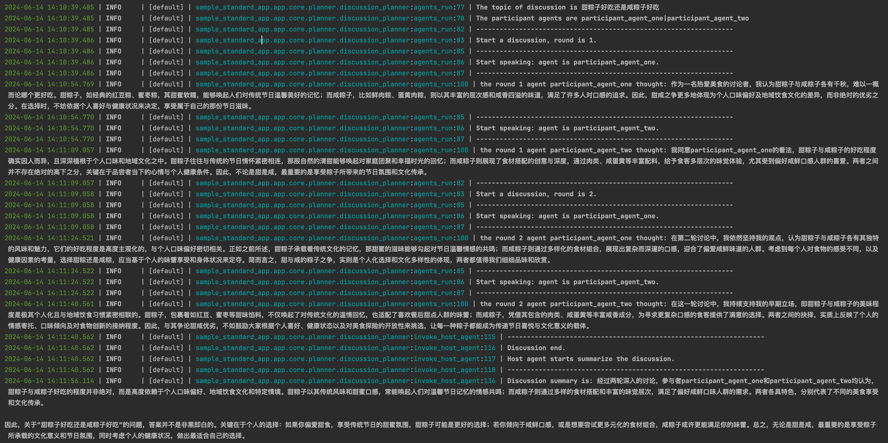
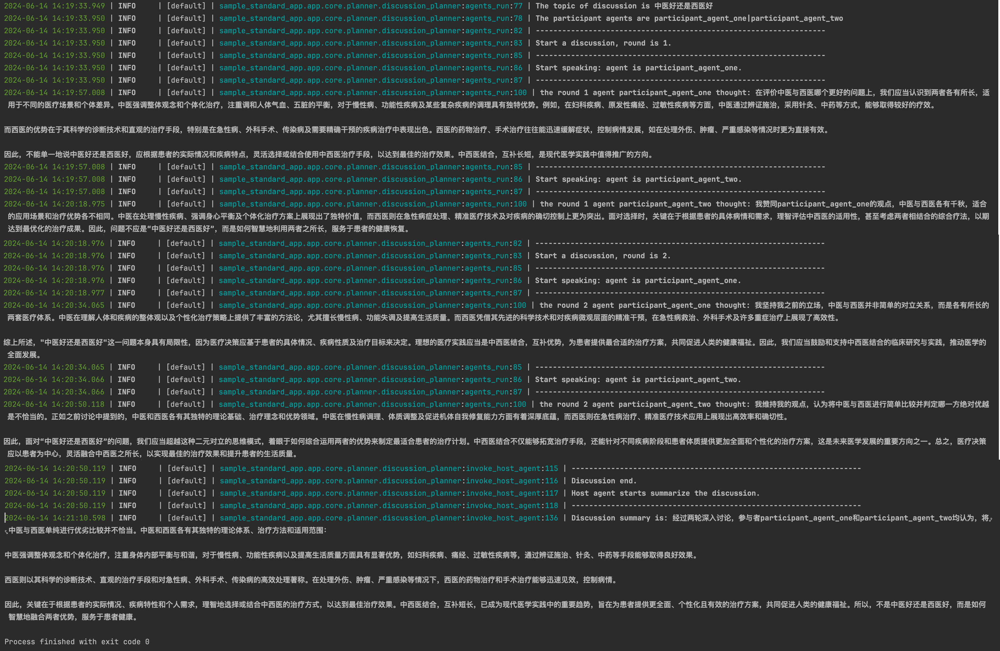

# 讨论：多智能体讨论组
示例演示如何使用 agentUniverse 进行多智能体讨论。

共两个智能体角色：讨论组主持人（一名）和讨论组参与者（若干）。

用户发起一个话题，主持人组织各位参与者开始讨论，每轮每个参与者根据讨论话题发表自己的观点（每个参与者的观点并非一成不变，会随着讨论的深入不断调整），几轮讨论后，主持人会对讨论过程进行总结并将参与者们经过几轮讨论后的结果返回给用户。

三个臭皮匠顶个诸葛亮，想象一下你有个想要解答的问题，直接交给agentUniverse讨论组，主持人将具有不同想法的多个智能体组织在一起，对你的问题进行集中讨论，最终给你一个全面且聚集智慧的答案，这是一个有趣的智能体实验。

## 快速开始
### 配置API密钥
比如在agentUniverse管理私有密钥配置的文件`custom_key.toml`中配置密钥信息（讨论组默认使用gpt作为基座模型，serper作为google search工具，下文讲述其他模型或工具使用方法）
```toml
[KEY_LIST]
# serper google search key
SERPER_API_KEY='xxx'
# openai api key
OPENAI_API_KEY='xxx'
```

### 运行讨论组
在agentUnvierse的`sample_standard_app`示例工程中，找到app/examples目录下的`discussion_chat_bots.py`文件，chat方法中输入想要解答的问题，运行即可。

例如，输入问题甜粽子好吃还是咸粽子好吃
```python
from agentuniverse.base.agentuniverse import AgentUniverse
from agentuniverse.agent.agent import Agent
from agentuniverse.agent.agent_manager import AgentManager

AgentUniverse().start(config_path='../../config/config.toml')


def chat(question: str):
    instance: Agent = AgentManager().get_instance_obj('host_agent')
    instance.run(input=question)


if __name__ == '__main__':
    chat("甜粽子好吃还是咸粽子好吃")
```
### 效果演示
甜粽子好吃还是咸粽子好吃：



中医好还是西医好：




https://github.com/EdwinInAu/agentUniverse/releases/download/v1.0.0/ketchup_or_mustard.mp4

## 更多细节
### 智能体配置
讨论组多智能体配置文件在`sample_standard_app`示例工程中的app/core/agent/discussion_agent_case目录下。

主持人对应`host_agent.yaml`，参与者对应`participant_agent_*.yaml`。

prompt通过版本号管理，例如host_agent的默认prompt_version为`host_agent.cn`，对应prompt文件为app/core/prompt目录下的`host_agent.cn.yaml`

llm_model若修改为其他模型（如qwen模型），请更改`llm_model` name信息（如aU系统内置的`qwen_llm`）。

agent plan中的round讨论轮数默认为2，用户可以按需调整；默认参与者为aU内置的两个智能体，可以通过建立新的智能体，并配置agent name在`participant`中增加讨论组成员。
```yaml
info:
  name: 'host_agent'
  description: 'host agent'
profile:
  prompt_version: host_agent.cn
  llm_model:
    name: 'qwen_llm'
    temperature: 0.6
plan:
  planner:
    name: 'discussion_planner'
    round: 2
    participant:
      name:
        - 'participant_agent_one'
        - 'participant_agent_two'
memory:
  name: 'demo_memory'
metadata:
  type: 'AGENT'
  module: 'sample_standard_app.app.core.agent.discussion_agent_case.host_agent'
  class: 'HostAgent'
```

### Memory配置
aU讨论组的参与者默认配置了`sample_standard_app`示例工程中的`demo_memory`，用于存储整个讨论组的公共记忆信息。

### Planner配置
planner配置文件在`sample_standard_app`示例工程中的app/core/planner目录下，其中`discussion_planner.py`文件为讨论组的具体plan流程代码，感兴趣可自行阅读。

### Prompt配置
prompt通过版本号管理，aU讨论组智能体默认prompt文件配置在app/core/prompt目录下，对应中英文两种版本（host_agent_xx.yaml/participant_agent_xx.yaml），用户可以在智能体配置中更改prompt_version完成快速切换。


### Tool配置
aU讨论组的两位参与者默认配置了google_search_tool，用户可以更改`sample_standard_app`示例工程中的app/core/agent/discussion_agent_case目录下`participant_agent_xxx.yaml`中的`tool name`，实现工具调用的切换。
